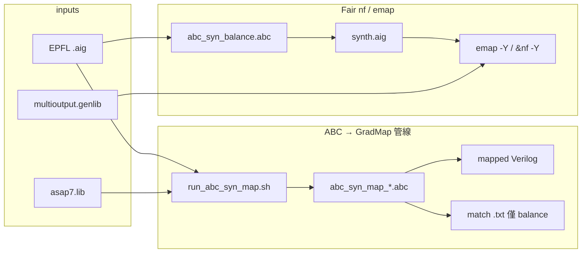

# Scripts 使用說明

本文件描述 `scripts/` 目錄下各腳本與 ABC 模板的**功能、用法、輸出與彼此關係**。

目錄依副檔名分類：

| 子目錄 | 內容 |
|--------|------|
| [`scripts/sh/`](../scripts/sh/) | Bash runners / libs（`.sh`） |
| [`scripts/py/`](../scripts/py/) | Python validators / tools（`.py`） |
| [`scripts/abc/`](../scripts/abc/) | ABC 模板（`.abc`） |

呼叫範例：`./scripts/sh/redump_emap_y_fair.sh`、`python3 scripts/py/validate_emap_nf_y_multi.py`。

> **維護規則**：新增、刪除或修改 `scripts/` 內任何檔案時，**必須同步更新本文件**（含快速對照表、範例命令、placeholder 說明、相依環境變數）。

---

## 快速對照

| 檔案 | 類型 | 功能摘要 | 主要呼叫者 |
|------|------|----------|-----------|
| [`run_abc_syn_map.sh`](../scripts/sh/run_abc_syn_map.sh) | Bash | ABC 合成 + `&nf` / `&nf -Y` mapping，批次跑 EPFL | 使用者 / CI |
| [`run_abc_emap_map.sh`](../scripts/sh/run_abc_emap_map.sh) | Bash | ABC balance 合成 + ABC-native `emap -Y` match dump + Verilog | 使用者 |
| [`run_fair_nf_emap_compare.sh`](../scripts/sh/run_fair_nf_emap_compare.sh) | Bash | **公平比較**：共用一份 `synth.aig` → map-only `&nf -Y` 與 `emap -Y` → Liberty STA | 使用者 |
| [`compare_nf_emap_map.sh`](../scripts/sh/compare_nf_emap_map.sh) | Bash | 比對 `&nf -Y` vs `emap -Y` mapping QoR，輸出 markdown | 使用者 |
| [`validate_emap_mog_root_overlap.py`](../scripts/py/validate_emap_mog_root_overlap.py) | Python | 驗證 emap `nf_y_multi` 的 FA/HA root-pair **不重疊**（無 `[a,b]`∩`[b,c]`） | 使用者 / CI |
| [`validate_emap_mog_semantic_dedup.py`](../scripts/py/validate_emap_mog_semantic_dedup.py) | Python | MO BIND **semantic endpoint-order** dedup（ROOTS/ROLES 換序不可重複） | 使用者 / CI |
| [`validate_emap_so_exact_dedup.py`](../scripts/py/validate_emap_so_exact_dedup.py) | Python | 驗證 SO candidates exact／nf-like dedup 與 selected `M` | 使用者 / CI |
| [`validate_emap_nf_y_multi.py`](../scripts/py/validate_emap_nf_y_multi.py) | Python | **Phase 4 統一 validator**（SO + MOG + top-K stats；streaming） | 使用者 / CI |
| [`emap_so_policy_lib.sh`](../scripts/sh/emap_so_policy_lib.sh) | Bash lib | `--so-dedup`／`--so-cut-topk` → `emap -D/-K` | runners |
| [`run_emap_so_policy_compare.sh`](../scripts/sh/run_emap_so_policy_compare.sh) | Bash | SO export 政策 A–F 量化（fair ASAP7） | 使用者 |
| [`regression_emap_so_export.sh`](../scripts/sh/regression_emap_so_export.sh) | Bash | Phase 4 regression（M1/M2/M3、CEC、invariance、smokes） | 使用者 / CI |
| [`cec_fair_nf_emap.sh`](../scripts/sh/cec_fair_nf_emap.sh) | Bash | 對已有 fair 輸出的 nf/emap `.v` vs 共用 `synth.aig` 做 ABC CEC | 使用者 |
| [`hard_replay_emap_mog.sh`](../scripts/sh/hard_replay_emap_mog.sh) | Bash | Phase 3C：從 `matches.nf_y_multi.txt` 的 M/MBIND hard-replay → Verilog → CEC | 使用者 |
| [`redump_emap_y_fair.sh`](../scripts/sh/redump_emap_y_fair.sh) | Bash | 在既有 fair tree 上重跑 `emap -Y`（不重 synth；修 dump bug 後用） | 使用者 |
| [`merge_emap_twins.py`](../scripts/py/merge_emap_twins.py) | Python | 合併 emap twin FA/HA Verilog，供 `read -m` / stime / CEC | `cec_fair_nf_emap.sh` / compare |
| [`list_epfl_benchmarks.sh`](../scripts/sh/list_epfl_benchmarks.sh) | Bash | 從 `data/epfl/*.yaml` 列出或解析 benchmark | 上述 runners |
| [`abc_syn_map_resyn2.abc`](../scripts/abc/abc_syn_map_resyn2.abc) | ABC | resyn2 合成 + `&nf` → Verilog | `run_abc_syn_map.sh --flow resyn2` |
| [`abc_syn_map_deepsyn.abc`](../scripts/abc/abc_syn_map_deepsyn.abc) | ABC | `&deepsyn` 合成 + `&nf` → Verilog | `run_abc_syn_map.sh --flow deepsyn` |
| [`abc_syn_map_balance.abc`](../scripts/abc/abc_syn_map_balance.abc) | ABC | balance 合成 + `&nf -Y` match + Verilog | `run_abc_syn_map.sh --flow balance` |
| [`abc_syn_balance.abc`](../scripts/abc/abc_syn_balance.abc) | ABC | balance 合成 only → `synth.aig`（無 mapping） | `run_fair_nf_emap_compare.sh` |
| [`abc_map_nf_y.abc`](../scripts/abc/abc_map_nf_y.abc) | ABC | map-only：`read synth.aig` → `&nf -Y` → Verilog | `run_fair_nf_emap_compare.sh` |
| [`abc_map_emap_y.abc`](../scripts/abc/abc_map_emap_y.abc) | ABC | map-only：`read synth.aig` → `emap -Y` → Verilog | `run_fair_nf_emap_compare.sh` |
| [`abc_emap_map.abc`](../scripts/abc/abc_emap_map.abc) | ABC | balance 合成 + `emap -Y` → Verilog | `run_abc_emap_map.sh` |
| [`generate_libcell_info_v2_multi_output.py`](../scripts/py/generate_libcell_info_v2_multi_output.py) | Python | Liberty → `libcell_info_v2_multi_output`（含 FA/HA） | 使用者（離線產 libcell） |

---

## 管線總覽



---

## 共用前置條件

### 路徑與依賴

| 項目 | 預設路徑 | 說明 |
|------|----------|------|
| `graduate-abc` | `third_party/GRADUATE/build_abc_frontend/graduate-abc` | ABC 需從 GRADUATE 目錄執行（載入 `abc.rc`） |
| Liberty | `third_party/GRADUATE/third_party/gradmap_libs/asap7.lib` | `read_lib` / `&nf` 用 |
| EPFL benchmarks | `third_party/benchmarks/EPFL/` | 通常為 symlink |
| GENLIB（emap） | `third_party/GRADUATE/third_party/gradmap_libs/asap7.genlib` | fair／正式 dump 用 |

### EPFL scale 定義

由 `data/epfl/{tiny,small,medium,large}.yaml` 定義（`--scale all` = 四個 scale 聯集）：

| Scale | AND gates |
|-------|-----------|
| `tiny` | &lt; 1,000 |
| `small` | 1,000 – 4,999 |
| `medium` | 5,000 – 19,999 |
| `large` | ≥ 20,000 |

詳見 [`data/epfl/README.md`](../data/epfl/README.md)。

### 共用環境變數

| 變數 | 用途 |
|------|------|
| `GRADUATE_ABC` | 覆寫 `graduate-abc` 路徑 |
| `GRADUATE_LIBERTY` | 覆寫 Liberty 路徑 |
| `GRADUATE_REC_LIB` | `rec_start3` 用的 `.aig`（選用） |
| `GRADUATE_DIR` | GRADUATE 根目錄 |
| `BENCH_ROOT` | benchmark 根目錄 |
| `DEEPSYN_ARGS` | 覆寫 `&deepsyn` 參數 |
| `OUT_ROOT` | 覆寫輸出目錄 |
| `JOBS` | 平行 job 數 |
| `EMAP_GENLIB` | 覆寫 emap GENLIB 路徑 |

---

## Bash runners

### `run_abc_syn_map.sh`

**功能**：對 EPFL（或其他）`.aig` 批次執行 ABC **合成 + technology mapping**，輸出 mapped Verilog；`balance` flow 另產 GradMap 用的 `&nf -Y` match file。

**Flows**：

| `--flow` | ABC 模板 | 合成 | Mapping | 額外輸出 |
|----------|----------|------|---------|----------|
| `resyn2` | `abc_syn_map_resyn2.abc` | IWLS resyn2 | `&nf` | Verilog |
| `deepsyn` | `abc_syn_map_deepsyn.abc` | `&deepsyn` | `&nf` | Verilog |
| `balance` | `abc_syn_map_balance.abc` | `&if` + resyn2 + `&deepsyn` | `&nf -Y` | match `.txt` + Verilog |

**常用選項**：

```bash
./Nonescripts/sh/run_abc_syn_map.sh --flow balance --scale tiny --parallel
./Nonescripts/sh/run_abc_syn_map.sh --flow resyn2 --cases "adder bar ctrl"
./Nonescripts/sh/run_abc_syn_map.sh --flow deepsyn --out output/my_run --jobs 4
./Nonescripts/sh/run_abc_syn_map.sh --flow balance --rec-start3   # 需 GRADUATE_REC_LIB
./Nonescripts/sh/run_abc_syn_map.sh --flow deepsyn --if-preprocess
```

| 選項 | 說明 |
|------|------|
| `--flow resyn2\|deepsyn\|balance` | 選擇合成/mapping 後端 |
| `--scale tiny\|small\|medium\|large\|all` | 從 yaml 載入 case 清單 |
| `--cases "a b c"` | 手動指定 benchmark 名稱（不含 `.aig`） |
| `--suite NAME` | 限定 EPFL 子目錄（如 `arithmetic`） |
| `--out DIR` | 輸出根目錄（預設 `output/abc_syn_map_<timestamp>/`） |
| `--jobs N` / `--parallel` | 平行執行 |
| `--timeout SEC` | 每 case 逾時（預設 600） |
| `--rec-start3` | 合成前 `rec_start3` |
| `--if-preprocess` | deepsyn 前 `&if -y -K 6` + resyn2（僅 deepsyn flow） |

**輸出結構**（每 case）：

```text
output/abc_syn_map_<timestamp>/<case>/
  run.abc              # 渲染後的 ABC 腳本
  run.log
  <case>_<flow>.v      # mapped Verilog
  <case>.txt            # 僅 balance：&nf -Y match dump
  report.line           # 彙整進 report.md
```

**報告**：`output/.../report.md`

**相關文件**：[`GRADUATE.md`](GRADUATE.md)、[`ABC_MOCKTURTLE_MULTI_OUTPUT.md`](ABC_MOCKTURTLE_MULTI_OUTPUT.md)（`&nf -Y` 語意）

---

### `list_epfl_benchmarks.sh`

**功能**：讀取 `data/epfl/*.yaml`，列出 benchmark 名稱、yaml 路徑或解析成絕對 `.aig` 路徑。

```bash
./Nonescripts/sh/list_epfl_benchmarks.sh small
./Nonescripts/sh/list_epfl_benchmarks.sh medium large
./Nonescripts/sh/list_epfl_benchmarks.sh --path tiny adder
./Nonescripts/sh/list_epfl_benchmarks.sh --yaml all
```

| 模式 | 行為 |
|------|------|
| （預設） | 印出所有 `name:` |
| `--path <scale> <name>` | 印出絕對路徑 |
| `--yaml <scale>` | 印出使用的 yaml 檔路徑 |

---

## ABC 腳本模板（`.abc`）

這些檔案**不要直接執行**；含 `__PLACEHOLDER__`，由 Bash runner 以 `sed` 替換後寫入各 case 的 `run.abc` / `synth.abc`，再從 **GRADUATE 根目錄**執行：

```bash
cd third_party/GRADUATE && ./build_abc_frontend/graduate-abc -f /path/to/rendered.abc
```

### Placeholder 對照

| Placeholder | 用於 | 替換內容 |
|-------------|------|----------|
| `__INPUT_AIG__` | 全部 | 輸入 `.aig` 絕對路徑 |
| `__LIBERTY__` | 全部 | `asap7.lib` 路徑 |
| `__OUTPUT_V__` | `*_map_*.abc` | mapped Verilog 路徑 |
| `__OUTPUT_AIG__` | `abc_syn_balance.abc` | 合成後 AIG 路徑 |
| `__MATCH_FILE__` | `abc_syn_map_balance.abc` | `&nf -Y` match dump 路徑 |
| `__DEEPSYN_ARGS__` | balance / deepsyn | 預設 balance/deepsyn 各不同 |
| `__REC_START3__` | balance / deepsyn | `rec_start3 <aig>` 或空 |
| `__PRE_DEEPSYN__` | deepsyn only | `&if -y -K 6; &put; resyn2; resyn2; &get` 或空 |

### `abc_syn_map_resyn2.abc`

resyn2（展開版 `balance; rewrite; refactor; ...`）→ `read_lib` → `&nf` → `write_verilog` → `stime`。

### `abc_syn_map_deepsyn.abc`

`&deepsyn` → `&nf` → Verilog。可選 `--if-preprocess`、`--rec-start3`。

### `abc_syn_map_balance.abc`

`&if -y -K 6` + resyn2 + `&deepsyn -T 120` → `&nf -Y`（match dump）→ `write_verilog`。GradMap / cover 實驗用。

### `abc_syn_balance.abc`

與 balance 合成段相同，但**不做** `&nf`；最後 `write_aiger __OUTPUT_AIG__`。供 `run_fair_nf_emap_compare.sh` Phase 1（共用 `synth.aig`）。

---

## Python 工具

### `generate_libcell_info_v2_multi_output.py`

**功能**：從 Liberty 產生 **`libcell_info_v2_multi_output`** 格式，保留 multi-output cell（FA/HA 等）。延伸自 GRADUATE 的 `generate_libcell_info_v2.py`。

```bash
./Nonescripts/py/generate_libcell_info_v2_multi_output.py \
  third_party/GRADUATE/third_party/gradmap_libs/asap7.lib \
  -o output/asap7_libcell_info_v2_multi_output.txt
```

| 選項 | 說明 |
|------|------|
| `libs`（位置參數） | 一個或多個 `.lib` |
| `-o` / `--output` | 輸出檔路徑（必填） |
| `--include-tie-cells` | 保留 TIEHI/TIELO |

**詳細格式說明**：[`GENERATE_LIBCELL_INFO_V2_MULTI_OUTPUT.md`](GENERATE_LIBCELL_INFO_V2_MULTI_OUTPUT.md)

> 截至目前 GradMap **尚未**讀取此格式；主要供本專案後續 timing / binding model 使用。

---

## `run_fair_nf_emap_compare.sh`

**功能**：**公平**比對 `&nf -Y` vs `emap -Y`——每個 case **只合成一次**（或重用既有 `synth.aig`），再分別做 map-only，最後呼叫 `compare_nf_emap_map.sh` 做 Liberty `stime`。

```text
EPFL .aig
   │
   ▼
abc_syn_balance.abc  ──►  synth/<case>/synth.aig   （或 --reuse-synth-from）
   │
   ├──────────────────────┬──────────────────────┐
   ▼                      ▼                      │
abc_map_nf_y.abc     abc_map_emap_y.abc          │
&nf -Y               emap -Y                     │
   │                      │                      │
   ▼                      ▼                      │
nf/<case>/            emap/<case>/               │
*_nf.v + match        *_emap.v + matches         │
   │                      │                      │
   └──────────┬───────────┘                      │
              ▼                                  │
   compare_nf_emap_map.sh  → compare_nf_emap.md  │
```

**範例**：

```bash
# 重用先前 emap 跑出的 synth.aig（跳過 deepsyn；推薦）
./Nonescripts/sh/run_fair_nf_emap_compare.sh --scale all --parallel \
  --reuse-synth-from output/abc_emap_map_20260710_162632

# 從頭 deepsyn（慢；AND 仍保證兩邊相同）
./Nonescripts/sh/run_fair_nf_emap_compare.sh --cases "adder ctrl" --jobs 2

# smoke
./Nonescripts/sh/run_fair_nf_emap_compare.sh --cases "adder ctrl" --jobs 2 \
  --reuse-synth-from output/abc_emap_map_20260710_162632 \
  --out output/fair_nf_emap_smoke --cec
```

**輸出**：

```text
output/fair_nf_emap_<ts>/
  synth/<case>/synth.aig
  nf/<case>/{synth.aig, synth_and.txt, <case>_nf.v, <case>.txt, run.log}
  emap/<case>/{synth.aig, synth_and.txt, <case>_emap.v, matches.nf_y_multi.txt, run.log}
  report.md
  compare_nf_emap.md
```

兩邊 `synth_and.txt` 相同 ⇒ 報告中 `ΔAND%` 必為 `+0.0%`。

---

## `compare_nf_emap_map.sh`

**功能**：比對兩個 mapping 輸出目錄（`&nf -Y` vs `emap -Y`），並用**同一份 ASAP7 Liberty `stime`** 重跑 STA。建議輸入來自 `run_fair_nf_emap_compare.sh`（共用 `synth.aig`）；亦可比對舊的獨立 balance / emap 跑次（AND 可能因 `&deepsyn -T` 而不同）。

**STA 流程**（兩邊相同）：

```text
read_lib asap7.lib
read -m <mapped.v>     # emap 先做 Liberty 相容前處理
topo
stime                  # Gates / Area / Delay（同一單位）
```

emap 前處理：合併 twin FA/HA、補齊未用 CON/SN；`MAJIx2`→`MAJIxp5`；`XNOR3x1`→`XNOR2x1` cascade（僅為 STA 可跑）。

**範例**：

```bash
./Nonescripts/sh/compare_nf_emap_map.sh \
  --nf-dir output/abc_syn_map_20260709_201016 \
  --emap-dir output/abc_emap_map_20260710_162632 \
  --jobs 8

./Nonescripts/sh/compare_nf_emap_map.sh \
  --nf-dir output/abc_syn_map_20260709_201016 \
  --emap-dir output/abc_emap_map_20260710_162632 \
  --force-stime --out output/compare_nf_emap.md
```

**報告欄位**：post-synth AND、Liberty gates/area/delay、Δ%、emap MBIND。

**快取**：每 case 寫入 `<case>/stime_asap7.txt`（emap 另存 `*_emap_merged.v`）。

**預設輸出**：`<emap-dir>/compare_nf_emap.md`

---

## `validate_emap_mog_root_overlap.py`

**功能**：檢查 emap `matches.nf_y_multi.txt` 裡 FA/HA（MOG）的 **root-pair 是否形成 matching**——不同 binding 不可共用 AIG node。例如 `[a,b]→FA` 與 `[b,c]→HA` 會判為 FAIL。同一 root-pair 的多個 `BIND`（pin permutation / 不同 fanin 排列）視為合法替代，不算重疊。

**檢查範圍**（串流讀檔，可處理 GB 級 dump）：

1. `# --- MOG tuple candidates ---` 的 `BIND` + `ROOTS`
2. `# --- multi-output bindings (selected) ---` 的 `BIND` + `ROOTS`
3. `MBIND` 與 selected `BIND` id／cell 一致性，以及 MBIND 之間的 node 重疊

**範例**：

```bash
# 驗證 consolidated fair 跑次的 emap -M 3 dump
./Nonescripts/py/validate_emap_mog_root_overlap.py output/fair_nf_emap_asap7genlib/emap

# 單一 case
./Nonescripts/py/validate_emap_mog_root_overlap.py \
  output/fair_nf_emap_asap7genlib/emap/adder/matches.nf_y_multi.txt

# 連 emap_l1 一起查
./Nonescripts/py/validate_emap_mog_root_overlap.py output/fair_nf_emap_asap7genlib --include-l1
```

**退出碼**：全部通過 `0`；任一 overlap／格式問題 `1`。

---

## `validate_emap_so_exact_dedup.py`

**功能**：檢查 `matches.nf_y_multi.txt` 的 SO candidates dedup／selected 對齊。

```bash
# Phase 1：禁止 exact duplicate
./Nonescripts/py/validate_emap_so_exact_dedup.py --exact path/to/matches.nf_y_multi.txt

# Phase 2：禁止 nf-like duplicate，並檢查每個 SO ``M`` 有 exact SO candidate
./Nonescripts/py/validate_emap_so_exact_dedup.py --nf-like --check-selected --require-so \
  path/to/emap_dir

# Phase 3：同上；搭配 emap -D 2 -K 16 產出後驗證（top-K 不影響 --check-selected）
./Nonescripts/py/validate_emap_so_exact_dedup.py --nf-like --check-selected path/to/matches.nf_y_multi.txt
```

**退出碼**：通過 `0`；否則 `1`。

相關 emap CLI（`graduate-abc`）：

| 選項 | 預設 | 語意 |
|------|------|------|
| `-D 0\|1\|2` | `1`（emap 本體） | SO dedup：none／exact／nf-like |
| `-K <num>` | `0`（emap 本體） | SO **export-only** cut top-K（`0`＝全 cuts；不改 `EMAP_CUT_MAX`） |

**腳本正式政策**（`run_abc_emap_map.sh`／`run_fair_nf_emap_compare.sh`／`redump_emap_y_fair.sh`）：

| Script option | 預設 | 對應 emap |
|---------------|------|-----------|
| `--so-dedup none\|exact\|nf-like` | **`nf-like`** | `-D 0\|1\|2` |
| `--so-cut-topk N` | **`16`** | `-K N` |

關閉／回退：

```bash
# Legacy unlimited（Phase 0 行為）
--so-dedup none --so-cut-topk 0

# Exact only、無 top-K（≈ Phase 1）
--so-dedup exact --so-cut-topk 0

# nf-like、無 top-K（≈ Phase 2）
--so-dedup nf-like --so-cut-topk 0

# Formal GradMap（預設）
--so-dedup nf-like --so-cut-topk 16

# 回退更大 cut diversity
--so-dedup nf-like --so-cut-topk 32
```

---

## `validate_emap_mog_semantic_dedup.py`

**功能**：驗證 MO BIND semantic endpoint-order exact dedup（同一 section 無重複 physical key；`BIND:`／`MBIND` 可解析；`--self-test` 跑 endpoint-order／fanin／role-swap fixture）。

```bash
./Nonescripts/py/validate_emap_mog_semantic_dedup.py --self-test
./Nonescripts/py/validate_emap_mog_semantic_dedup.py path/to/matches.nf_y_multi.txt
./Nonescripts/py/validate_emap_mog_semantic_dedup.py output/fair_nf_emap_asap7genlib/emap
```

與 [`validate_emap_mog_root_overlap.py`](../scripts/py/validate_emap_mog_root_overlap.py) 互補：overlap 查不同 pair 是否共享 base node；本腳本查同一 physical candidate 是否重複輸出。

---

## `validate_emap_nf_y_multi.py`

**功能**：Phase 4 統一 streaming validator（SO exact／nf-like、selected `M`、MBIND↔BIND、MOG root-pair 不重疊、MO semantic dedup、`# so_export_stats` top-K 不變量）。

```bash
./Nonescripts/py/validate_emap_nf_y_multi.py --formal --require-so path/to/matches.nf_y_multi.txt
./Nonescripts/py/validate_emap_nf_y_multi.py --formal output/fair_nf_emap_asap7genlib/emap
```

---

## `validate_emap_mog_semantic_dedup.py`

**功能**：檢查 MO `BIND` 無 **semantic endpoint-order** 重複（與 emap exporter `Emap_DumpMoSemanticKey` 一致）。

- key = `cell` + **ordered** `FANINS`（不排序）+ 依 role name 排序的 `(role, root_lit)`  
- `ROOTS/ROLES` 同步換序且 role→root 相同 → **FAIL**  
- `FANINS [2,5]` vs `[5,2]` → 必須保留為兩筆  

```bash
./Nonescripts/py/validate_emap_mog_semantic_dedup.py --require-mo-dedup-header \
  output/fair_nf_emap_asap7genlib/emap/ctrl/matches.nf_y_multi.txt
```

---

## `run_emap_so_policy_compare.sh`

**功能**：在 fair `synth.aig` 上 map-only 比較政策 A–F，輸出 CSV／markdown。

```bash
./Nonescripts/sh/run_emap_so_policy_compare.sh --cases "adder ctrl cavlc sin" --cec
./Nonescripts/sh/run_emap_so_policy_compare.sh --policies "C E F" --cases adder
```

---

## `regression_emap_so_export.sh`

**功能**：Phase 4 regression（`-M 1/2/3`、K=0/16、CEC、BIND／MBIND／M 不變、deterministic re-dump、`&nf`／GradSyn／GradMap／sequential smoke）。

```bash
./Nonescripts/sh/regression_emap_so_export.sh
./Nonescripts/sh/regression_emap_so_export.sh --cases "adder ctrl" --skip-smokes
```

---

## `cec_fair_nf_emap.sh`

**功能**：對 **已存在** 的 fair 比較輸出做 equivalence checking（**不 remap**）。每個 case：

- `nf/<case>/*_nf.v` vs `synth/<case>/synth.aig`
- `emap|emap_l1/<case>/*_emap.v` vs 同一份 `synth.aig`（先經 [`merge_emap_twins.py`](../scripts/py/merge_emap_twins.py) 合併 FA/HA twin）

```bash
./Nonescripts/sh/cec_fair_nf_emap.sh
./Nonescripts/sh/cec_fair_nf_emap.sh --root output/fair_nf_emap_asap7genlib --parallel
./Nonescripts/sh/cec_fair_nf_emap.sh --emap-subdir emap_l1 --cases "adder square" --jobs 4
```

**輸出**：

| 路徑 | 內容 |
|------|------|
| `<root>/cec_report.md` | 每 case nf/emap pass／fail 表 |
| `<root>/cec_logs/<case>.{nf,emap}.log` | ABC 完整 log |
| `<emap>/<case>/*_emap_merged.v` | CEC 用的合併網表（必要時寫入） |

**退出碼**：全部 `pass` → `0`；任一 fail → `1`。

---

## `hard_replay_emap_mog.sh`

**功能**：Phase 3C hard replay。對 fair `emap/<case>/matches.nf_y_multi.txt`：

1. `graduate-map-hard-replay` 只依 `M` / `MBIND` 重建 Verilog（一顆 FA/HA 接齊 CON+SN）
2. ABC `read_genlib` + `read -m` + `cec` vs 共用 `synth.aig`

```bash
./Nonescripts/sh/hard_replay_emap_mog.sh --cases adder
./Nonescripts/sh/hard_replay_emap_mog.sh --root output/fair_nf_emap_asap7genlib --jobs 4
```

**輸出**：

| 路徑 | 內容 |
|------|------|
| `<root>/hard_replay/<case>/*_hard_replay.v` | GradMap 重建網表 |
| `<root>/hard_replay/cec_report.md` | pass／fail + `binding_instances` |
| `<root>/hard_replay/cec_logs/` | replay／CEC log |

**前置**：已 build `third_party/GRADUATE/build_abc_frontend/graduate-map-hard-replay`。

---

## `run_abc_emap_map.sh` / `abc_emap_map.abc`

**功能**：與 [`abc_syn_map_balance.abc`](../scripts/abc/abc_syn_map_balance.abc) **共用同一段** balance 合成（`&if -y -K 6` + resyn2 + `&deepsyn -T 120`），只在 mapping 換成 `emap -Y`。用於公平比較 `&nf -Y` vs `emap -Y`。

```text
abc_syn_map_balance.abc          abc_emap_map.abc
─────────────────────            ────────────────
read; strash; read_lib           (identical)
&if + resyn2; &deepsyn           (identical)
strash; write_aiger synth.aig    (identical)
&get; &nf -Y; &put               read_genlib; emap -Y
write_verilog                    write_verilog
```

**範例**：

```bash
# 與 output/abc_syn_map_20260709_201016 相同的 EPFL 全集
./Nonescripts/sh/run_abc_emap_map.sh --scale all --parallel --dump-level 1

./Nonescripts/sh/run_abc_emap_map.sh --cases "adder ctrl" --dump-level 1 --cec
./Nonescripts/sh/run_abc_emap_map.sh --dump-level 3   # 預設也是 --scale all
```

**選項**：

| 選項 | 說明 |
|------|------|
| `--scale` / `--cases` | 預設 `--scale all`（arithmetic + random_control） |
| `--dump-level 1\|2\|3` | `emap -M`：1=warm start；2=+MOG tuples；3=+full SO cuts |
| `--emap-flags STR` | 預設 `-a -v`（area + verbose；MOG 預設開啟） |
| `--genlib PATH` | multioutput GENLIB |
| `--cec` | 對 mapped Verilog 與 `synth.aig` 做 CEC |

**輸出**（每 case）：

| 檔案 | 內容 |
|------|------|
| `synth.aig` | 與 `&nf -Y` 流程相同的 post-synth AIG |
| `matches.nf_y_multi.txt` | `emap -Y` match dump（含 `BIND` / `MBIND` / `M`） |
| `*_emap.v` | mapped Verilog |
| `run.abc` / `run.log` | 實際 ABC script 與 log |

**`emap -Y` 格式摘要**（`nf_y_multi_v1`）：

```text
# format: nf_y_multi_v1
<root_lit> <cell> <area> <n_fanins> <fanins...> 0 [BIND:<id>]
BIND <id> <cell> <area> <n_fanins> <fanins...> <root0> <root1>
  ROOTS ...
  ROLES CON SN
  FANINS ...
  COVER 0
M<root_lit> <cell> <area> <fanins...>
MBIND <id> <cell> <area> <fanins...>
```

---

## 規劃中（尚未實作）

以下見 [`ABC_MOCKTURTLE_MULTI_OUTPUT.md`](ABC_MOCKTURTLE_MULTI_OUTPUT.md) Phase 3：

| 項目 | 用途 |
|------|------|
| GradMap `nf_y_multi` parser | 讀 `BIND` / `MBIND`，binding-level softmax |
| `libcell_info_v2_multi_output` loader | MapLibrary 支援 FA/HA |

---

## 新增腳本時的檢查清單

新增或修改 `scripts/` 檔案時，請確認：

- [ ] 更新本文件**快速對照表**
- [ ] 新增獨立章節（功能、用法、選項、輸出、相依）
- [ ] 若為 ABC 模板，記錄 placeholder 與呼叫它的 runner
- [ ] 更新上方**管線總覽**（若流程有變）
- [ ] 在相關專題文件（如 `ABC_MOCKTURTLE_MULTI_OUTPUT.md`）加上交叉連結
- [ ] 腳本檔頭 comment 加上：`# See docs/SCRIPTS.md`

---

## 相關文件

| 文件 | 內容 |
|------|------|
| [`GRADUATE.md`](GRADUATE.md) | GRADUATE / GradMap / `graduate-abc` 建置 |
| [`GRADMAP.md`](GRADMAP.md) | GradMap 詳細說明（match file、訓練、multi-output） |
| [`MOCKTURTLE.md`](MOCKTURTLE.md) | mockturtle 子模組與 emap |
| [`ABC_MOCKTURTLE_MULTI_OUTPUT.md`](ABC_MOCKTURTLE_MULTI_OUTPUT.md) | ABC emap match dump + GradMap 整合規劃 |
| [`NF_EMAP_CANDIDATE_ORDER.md`](NF_EMAP_CANDIDATE_ORDER.md) | `&nf -Y`／`emap -Y` 候選枚舉與 dump 順序 |
| [`ASAP7_MULTI_OUTPUT_CELLS.md`](ASAP7_MULTI_OUTPUT_CELLS.md) | ASAP7 multi-output cell 盤點 |
| [`GENERATE_LIBCELL_INFO_V2_MULTI_OUTPUT.md`](GENERATE_LIBCELL_INFO_V2_MULTI_OUTPUT.md) | libcell_info 格式細節 |
