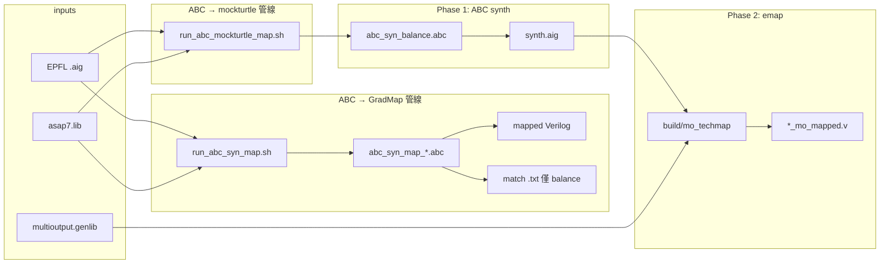

# Scripts 使用說明

本文件描述 `scripts/` 目錄下各腳本與 ABC 模板的**功能、用法、輸出與彼此關係**。

> **維護規則**：新增、刪除或修改 `scripts/` 內任何檔案時，**必須同步更新本文件**（含快速對照表、範例命令、placeholder 說明、相依環境變數）。

---

## 快速對照

| 檔案 | 類型 | 功能摘要 | 主要呼叫者 |
|------|------|----------|-----------|
| [`run_abc_syn_map.sh`](../scripts/run_abc_syn_map.sh) | Bash | ABC 合成 + `&nf` / `&nf -Y` mapping，批次跑 EPFL | 使用者 / CI |
| [`run_abc_mockturtle_map.sh`](../scripts/run_abc_mockturtle_map.sh) | Bash | ABC balance 合成（僅 AIG）+ mockturtle `mo_techmap` | 使用者 |
| [`list_epfl_benchmarks.sh`](../scripts/list_epfl_benchmarks.sh) | Bash | 從 `data/epfl/*.yaml` 列出或解析 benchmark | 上述兩個 runner |
| [`abc_syn_map_resyn2.abc`](../scripts/abc_syn_map_resyn2.abc) | ABC | resyn2 合成 + `&nf` → Verilog | `run_abc_syn_map.sh --flow resyn2` |
| [`abc_syn_map_deepsyn.abc`](../scripts/abc_syn_map_deepsyn.abc) | ABC | `&deepsyn` 合成 + `&nf` → Verilog | `run_abc_syn_map.sh --flow deepsyn` |
| [`abc_syn_map_balance.abc`](../scripts/abc_syn_map_balance.abc) | ABC | balance 合成 + `&nf -Y` match + Verilog | `run_abc_syn_map.sh --flow balance` |
| [`abc_syn_balance.abc`](../scripts/abc_syn_balance.abc) | ABC | balance 合成 only → `synth.aig`（無 mapping） | `run_abc_mockturtle_map.sh` |
| [`generate_libcell_info_v2_multi_output.py`](../scripts/generate_libcell_info_v2_multi_output.py) | Python | Liberty → `libcell_info_v2_multi_output`（含 FA/HA） | 使用者（離線產 libcell） |
| [`test_command.sh`](../scripts/test_command.sh) | 參考 | 早期 ABC 實驗腳本與驗證備註（非 runner） | 開發者參考 |

---

## 管線總覽



---

## 共用前置條件

### 路徑與依賴

| 項目 | 預設路徑 | 說明 |
|------|----------|------|
| `graduate-abc` | `third_party/GRADUATE/build_abc_frontend/graduate-abc` | ABC 需從 GRADUATE 目錄執行（載入 `abc.rc`） |
| Liberty | `third_party/GRADUATE/third_party/gradmap_libs/asap7.lib` | `read_lib` / `&nf` 用 |
| EPFL benchmarks | `third_party/benchmarks/EPFL/` | 通常為 symlink |
| `mo_techmap` | `build/mo_techmap` | 專案根目錄 CMake 建置（見 [`ABC_MOCKTURTLE_MULTI_OUTPUT.md`](ABC_MOCKTURTLE_MULTI_OUTPUT.md)） |
| GENLIB | `third_party/mockturtle/experiments/cell_libraries/multioutput.genlib` | mockturtle emap 用 |

### EPFL scale 定義

由 `data/epfl/{tiny,small,medium,large}.yaml` 定義（`--scale all` = 四個 scale 聯集）：

| Scale | AND gates |
|-------|-----------|
| `tiny` | &lt; 1,000 |
| `small` | 1,000 – 4,999 |
| `medium` | 5,000 – 19,999 |
| `large` | ≥ 20,000 |

詳見 [`data/epfl/README.md`](../data/epfl/README.md)。

### 共用環境變數

| 變數 | 用途 |
|------|------|
| `GRADUATE_ABC` | 覆寫 `graduate-abc` 路徑 |
| `GRADUATE_LIBERTY` | 覆寫 Liberty 路徑 |
| `GRADUATE_REC_LIB` | `rec_start3` 用的 `.aig`（選用） |
| `GRADUATE_DIR` | GRADUATE 根目錄 |
| `BENCH_ROOT` | benchmark 根目錄 |
| `DEEPSYN_ARGS` | 覆寫 `&deepsyn` 參數 |
| `OUT_ROOT` | 覆寫輸出目錄 |
| `JOBS` | 平行 job 數 |
| `MO_TECHMAP` | 覆寫 `mo_techmap` 路徑 |
| `MO_GENLIB` | 覆寫 GENLIB 路徑 |

---

## Bash runners

### `run_abc_syn_map.sh`

**功能**：對 EPFL（或其他）`.aig` 批次執行 ABC **合成 + technology mapping**，輸出 mapped Verilog；`balance` flow 另產 GradMap 用的 `&nf -Y` match file。

**Flows**：

| `--flow` | ABC 模板 | 合成 | Mapping | 額外輸出 |
|----------|----------|------|---------|----------|
| `resyn2` | `abc_syn_map_resyn2.abc` | IWLS resyn2 | `&nf` | Verilog |
| `deepsyn` | `abc_syn_map_deepsyn.abc` | `&deepsyn` | `&nf` | Verilog |
| `balance` | `abc_syn_map_balance.abc` | `&if` + resyn2 + `&deepsyn` | `&nf -Y` | match `.txt` + Verilog |

**常用選項**：

```bash
./scripts/run_abc_syn_map.sh --flow balance --scale tiny --parallel
./scripts/run_abc_syn_map.sh --flow resyn2 --cases "adder bar ctrl"
./scripts/run_abc_syn_map.sh --flow deepsyn --out output/my_run --jobs 4
./scripts/run_abc_syn_map.sh --flow balance --rec-start3   # 需 GRADUATE_REC_LIB
./scripts/run_abc_syn_map.sh --flow deepsyn --if-preprocess
```

| 選項 | 說明 |
|------|------|
| `--flow resyn2\|deepsyn\|balance` | 選擇合成/mapping 後端 |
| `--scale tiny\|small\|medium\|large\|all` | 從 yaml 載入 case 清單 |
| `--cases "a b c"` | 手動指定 benchmark 名稱（不含 `.aig`） |
| `--suite NAME` | 限定 EPFL 子目錄（如 `arithmetic`） |
| `--out DIR` | 輸出根目錄（預設 `output/abc_syn_map_<timestamp>/`） |
| `--jobs N` / `--parallel` | 平行執行 |
| `--timeout SEC` | 每 case 逾時（預設 600） |
| `--rec-start3` | 合成前 `rec_start3` |
| `--if-preprocess` | deepsyn 前 `&if -y -K 6` + resyn2（僅 deepsyn flow） |

**輸出結構**（每 case）：

```text
output/abc_syn_map_<timestamp>/<case>/
  run.abc              # 渲染後的 ABC 腳本
  run.log
  <case>_<flow>.v      # mapped Verilog
  <case>.txt            # 僅 balance：&nf -Y match dump
  report.line           # 彙整進 report.md
```

**報告**：`output/.../report.md`

**相關文件**：[`GRADUATE.md`](GRADUATE.md)、[`ABC_MOCKTURTLE_MULTI_OUTPUT.md`](ABC_MOCKTURTLE_MULTI_OUTPUT.md)（`&nf -Y` 語意）

---

### `run_abc_mockturtle_map.sh`

**功能**：兩階段管線——(1) ABC balance **僅合成** → `synth.aig`；(2) 專案 `mo_techmap` 做 **mockturtle multi-output emap** → mapped Verilog。

等同 `run_abc_syn_map.sh --flow balance` **去掉** `&nf -Y` 與 `write_verilog` 段。

**常用選項**：

```bash
./scripts/run_abc_mockturtle_map.sh --build-mo-techmap --cases adder --cec
./scripts/run_abc_mockturtle_map.sh --scale tiny --parallel
./scripts/run_abc_mockturtle_map.sh --map-only --cases adder   # 需已有 synth.aig
./scripts/run_abc_mockturtle_map.sh --skip-synth --cases adder
```

| 選項 | 說明 |
|------|------|
| `--build-mo-techmap` | 若缺少 binary，執行 `cmake -S . -B build` 並建置 `mo_techmap` |
| `--mo-techmap PATH` | 指定 `mo_techmap`（預設 `build/mo_techmap`） |
| `--genlib PATH` | GENLIB 路徑 |
| `--skip-synth` | 跳過 ABC（`synth.aig` 已存在時） |
| `--map-only` | 只做 Phase 2 mapping |
| `--delay-oriented` | emap 改為 delay-oriented（預設 area-oriented） |
| `--no-multioutput` | 關閉 multi-output cell mapping |
| `--cec` | mapping 後用 `graduate-abc cec` 驗證 |
| `--scale` / `--cases` / `--jobs` / `--parallel` / `--out` / `--rec-start3` | 同 `run_abc_syn_map.sh` |

**輸出結構**（每 case）：

```text
output/abc_mockturtle_map_<timestamp>/<case>/
  synth.abc
  synth.log
  synth.aig
  <case>_mo_mapped.v
  stats.txt              # area, delay, multioutput_gates, runtime
  map.log
  cec.log                # 僅 --cec
```

**相關文件**：[`ABC_MOCKTURTLE_MULTI_OUTPUT.md`](ABC_MOCKTURTLE_MULTI_OUTPUT.md)、[`MOCKTURTLE.md`](MOCKTURTLE.md)

---

### `list_epfl_benchmarks.sh`

**功能**：讀取 `data/epfl/*.yaml`，列出 benchmark 名稱、yaml 路徑或解析成絕對 `.aig` 路徑。

```bash
./scripts/list_epfl_benchmarks.sh small
./scripts/list_epfl_benchmarks.sh medium large
./scripts/list_epfl_benchmarks.sh --path tiny adder
./scripts/list_epfl_benchmarks.sh --yaml all
```

| 模式 | 行為 |
|------|------|
| （預設） | 印出所有 `name:` |
| `--path <scale> <name>` | 印出絕對路徑 |
| `--yaml <scale>` | 印出使用的 yaml 檔路徑 |

---

## ABC 腳本模板（`.abc`）

這些檔案**不要直接執行**；含 `__PLACEHOLDER__`，由 Bash runner 以 `sed` 替換後寫入各 case 的 `run.abc` / `synth.abc`，再從 **GRADUATE 根目錄**執行：

```bash
cd third_party/GRADUATE && ./build_abc_frontend/graduate-abc -f /path/to/rendered.abc
```

### Placeholder 對照

| Placeholder | 用於 | 替換內容 |
|-------------|------|----------|
| `__INPUT_AIG__` | 全部 | 輸入 `.aig` 絕對路徑 |
| `__LIBERTY__` | 全部 | `asap7.lib` 路徑 |
| `__OUTPUT_V__` | `*_map_*.abc` | mapped Verilog 路徑 |
| `__OUTPUT_AIG__` | `abc_syn_balance.abc` | 合成後 AIG 路徑 |
| `__MATCH_FILE__` | `abc_syn_map_balance.abc` | `&nf -Y` match dump 路徑 |
| `__DEEPSYN_ARGS__` | balance / deepsyn | 預設 balance/deepsyn 各不同 |
| `__REC_START3__` | balance / deepsyn | `rec_start3 <aig>` 或空 |
| `__PRE_DEEPSYN__` | deepsyn only | `&if -y -K 6; &put; resyn2; resyn2; &get` 或空 |

### `abc_syn_map_resyn2.abc`

resyn2（展開版 `balance; rewrite; refactor; ...`）→ `read_lib` → `&nf` → `write_verilog` → `stime`。

### `abc_syn_map_deepsyn.abc`

`&deepsyn` → `&nf` → Verilog。可選 `--if-preprocess`、`--rec-start3`。

### `abc_syn_map_balance.abc`

`&if -y -K 6` + resyn2 + `&deepsyn -T 120` → `&nf -Y`（match dump）→ `write_verilog`。GradMap / cover 實驗用。

### `abc_syn_balance.abc`

與 balance 合成段相同，但**不做** `&nf`；最後 `write_aiger __OUTPUT_AIG__`。供 mockturtle 管線 Phase 1。

---

## Python 工具

### `generate_libcell_info_v2_multi_output.py`

**功能**：從 Liberty 產生 **`libcell_info_v2_multi_output`** 格式，保留 multi-output cell（FA/HA 等）。延伸自 GRADUATE 的 `generate_libcell_info_v2.py`。

```bash
./scripts/generate_libcell_info_v2_multi_output.py \
  third_party/GRADUATE/third_party/gradmap_libs/asap7.lib \
  -o output/asap7_libcell_info_v2_multi_output.txt
```

| 選項 | 說明 |
|------|------|
| `libs`（位置參數） | 一個或多個 `.lib` |
| `-o` / `--output` | 輸出檔路徑（必填） |
| `--include-tie-cells` | 保留 TIEHI/TIELO |

**詳細格式說明**：[`GENERATE_LIBCELL_INFO_V2_MULTI_OUTPUT.md`](GENERATE_LIBCELL_INFO_V2_MULTI_OUTPUT.md)

> 截至目前 GradMap **尚未**讀取此格式；主要供本專案後續 timing / binding model 使用。

---

## 參考檔案

### `test_command.sh`

早期 GradMap 導向的 ABC 實驗腳本與**驗證備註**（非可執行 runner）。記錄了：

- 合成 → mapping 概念正確性
- 純 Verilog 用 `&nf`；GradMap match dump 用 `&nf -Y`
- `strash`、`read -m` + `stime` 等慣例

正式可執行流程請改用 `abc_syn_map_*.abc` 與 `run_abc_syn_map.sh`。

---

## 新增腳本時的檢查清單

新增或修改 `scripts/` 檔案時，請確認：

- [ ] 更新本文件**快速對照表**
- [ ] 新增獨立章節（功能、用法、選項、輸出、相依）
- [ ] 若為 ABC 模板，記錄 placeholder 與呼叫它的 runner
- [ ] 更新上方**管線總覽**（若流程有變）
- [ ] 在相關專題文件（如 `ABC_MOCKTURTLE_MULTI_OUTPUT.md`）加上交叉連結
- [ ] 腳本檔頭 comment 加上：`# See docs/SCRIPTS.md`

---

## 相關文件

| 文件 | 內容 |
|------|------|
| [`GRADUATE.md`](GRADUATE.md) | GRADUATE / GradMap / `graduate-abc` 建置 |
| [`MOCKTURTLE.md`](MOCKTURTLE.md) | mockturtle 子模組與 emap |
| [`ABC_MOCKTURTLE_MULTI_OUTPUT.md`](ABC_MOCKTURTLE_MULTI_OUTPUT.md) | ABC + mockturtle 整合與 Phase 規劃 |
| [`ASAP7_MULTI_OUTPUT_CELLS.md`](ASAP7_MULTI_OUTPUT_CELLS.md) | ASAP7 multi-output cell 盤點 |
| [`GENERATE_LIBCELL_INFO_V2_MULTI_OUTPUT.md`](GENERATE_LIBCELL_INFO_V2_MULTI_OUTPUT.md) | libcell_info 格式細節 |
